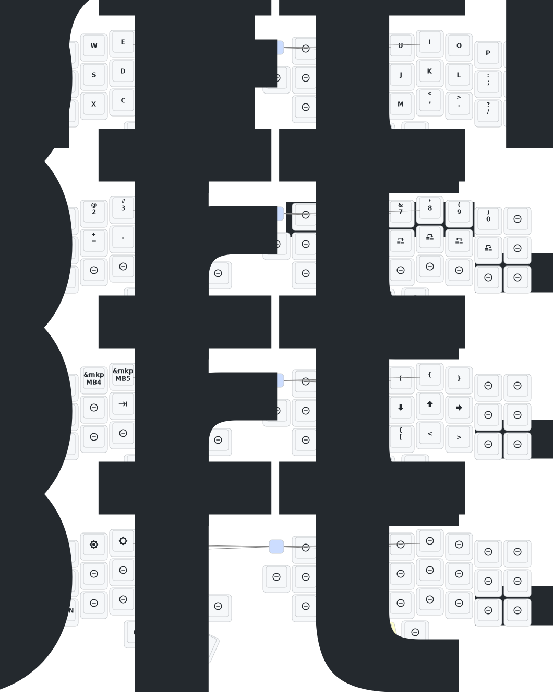

# 睫毛外设 (Eyelash Peripherals) Corne ZMK Repository

**This keyboard is not the same as [foostan's Corne](https://github.com/foostan/crkbd). It will not work with standard `corne` firmware.**

If you need a 3D model of this keyboard, email `380465425@qq.com`.
2025.8.22 update the soft off.When you press the keys Q, S and Z simultaneously and hold them for 2 seconds, the keyboard will enter a deep sleep state and cannot be awakened by pressing the keys. This function can be used when carrying it outside. The activation method is to press the reset switch once.This month, I also updated the ultra-thin versions of the corne and sofle cases. The frame and base plate have been thickened, and the opening of the reset switch has been adjusted, so that the reset switch can be easily pressed. At present, we are still conceptualizing how to design the shell with an inclined bracket.If you have carefully examined a PCB, you will notice that there are reserved interfaces for expansion IO. I wonder if anyone has been able to utilize them,I will try it！

2025/8/22
update the soft off.When you press the keys Q, S and Z simultaneously and hold them for 2 seconds, the keyboard will enter a deep sleep state and cannot be awakened by pressing the keys. This function can be used when carrying it outside. The activation method is to press the reset switch once.
This month, I also updated the ultra-thin versions of the corne and sofle cases. The frame and base plate have been thickened, and the opening of the reset switch has been adjusted, so that the reset switch can be easily pressed. At present, we are still conceptualizing how to design the shell with an inclined bracket.If you have carefully examined a PCB, you will notice that there are reserved interfaces for expansion IO. I wonder if anyone has been able to utilize them,I will try it！
The GIF animations on the right-hand keyboard screen have been removed, which will significantly reduce the power consumption of the right-hand keyboard.

-2026/6/22
The keyboard now supports key remapping via DYA STUDIO. Chinese users should contact the seller to obtain the Chinese version of the DYA STUDIO installer. This PC software offers better key remapping functionality than ZMK Studio. Website: https://studio.dya.cormoran.works/ https://studio.dya.cormoran.works/

## Instructions

1. [Fork this repository](https://docs.github.com/en/get-started/quickstart/fork-a-repo#forking-a-repository).
2. [Click the **Actions** tab and make sure the workflow is enabled](https://docs.github.com/en/actions/managing-workflow-runs-and-deployments/managing-workflow-runs/disabling-and-enabling-a-workflow#enabling-a-workflow).
3. Make sure the `eyelash_corne` project in [`config/west.yml`](config/west.yml) still works. The `boards/arm/eyelash_corne` folder will be downloaded from this URL.
4. If there is still a `boards/arm/eyelash_corne` folder in your fork, delete it.

Below steps taken from [Tan Anwar's fork](https://github.com/tanvir-anwar/zmk-new-corne).

4. Download the `.uf2` firmware artifacts from the completed workflow run. The build produces three files:
   - `eyelash_corne_studio_left` — left half (with ZMK Studio support)
   - `eyelash_corne_right` — right half
   - `nice_nano_v2_settings_reset` — settings reset utility (see below)
5. Flash each half:
   1. Keep the power switch **ON**.
   2. **Double-tap the reset button** — the board enters bootloader mode and appears as a USB drive.
   3. Drag the correct `.uf2` file onto the drive. It flashes and reboots automatically.
   4. Repeat for the other half.

### Settings Reset (source: [Tan Anwar's fork](https://github.com/tanvir-anwar/zmk-new-corne))

Flash `nice_nano_v2_settings_reset.uf2` to clear stored bonds, ZMK Studio overrides, and other saved settings. You'll need this when:

- **One half stops sending keypresses** — the BLE bond between halves is broken (most common after flashing new firmware to only one side).
- **Keys produce wrong output after a keymap change** — stale ZMK Studio overrides persist in flash and take priority over the compiled keymap.
- **Halves won't pair with each other or the host** — bond table is full or corrupted.

To reset:
1. Flash `nice_nano_v2_settings_reset.uf2` to the **right** half.
2. Flash `eyelash_corne_right` firmware to the **right** half.
3. Flash `nice_nano_v2_settings_reset.uf2` to the **left** half.
4. Flash `eyelash_corne_studio_left` firmware to the **left** half.
5. Power cycle both halves (toggle power switch off, wait 5 seconds, toggle on). They will re-pair automatically.

> **Why right first?** The left half is the BLE central — it initiates connections. If the left half boots with fresh bonds before the right half is reset, it may not discover the right half. Resetting and flashing the right (peripheral) first ensures it's ready to be found when the left half comes up.

### Troubleshooting (source: [Tan Anwar's fork](https://github.com/tanvir-anwar/zmk-new-corne))

**Right half powered on but no keypresses registered:**
The right half connects to the left half over BLE, not directly to the host. A lit display or RGB only confirms power — not a working BLE link. Try these steps in order:

1. **Power cycle both halves** — toggle both power switches off, wait 5 seconds, toggle both on simultaneously.
2. **Check the left half's display** — if it doesn't show a peripheral connection indicator, the halves aren't bonded.
3. **Move the halves close together** — keep them touching during initial pairing; some boards have weak BLE signal on first boot.
4. **Verify correct firmware** — confirm you flashed `eyelash_corne_right` (not left) to the right half.
5. **Full settings reset** — follow the reset procedure above (right half first, then left).

**Keys produce wrong output after a keymap change:**
ZMK Studio overrides persist in flash and take priority over the compiled keymap. Connect the left half via USB-C, open [ZMK Studio](https://zmk.studio/), and check for stale overrides — or do a full settings reset.

**Keyboard won't connect to host computer via Bluetooth:**
Press `BT_CLR_ALL` (Layer 1, leftmost key on the home row) to clear all host Bluetooth bonds, then re-pair from your computer's Bluetooth settings.

**If you already have a ZMK config repository, [you can add this one as a module instead of forking](https://zmk.dev/docs/features/modules#building-with-modules).**

## Keymap Diagram

